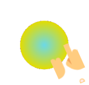

# touchable 👆🏻

<center>

[](#)

</center>

**Draw objects on your custom painter canvas and add full interactive capability to each object.**

## Demo :

<center>

[](#)

</center>


## Why Use **Touchable** ? 
- The CustomPainter lets you **only draw** shapes on the canvas. But most would want to let user interact with the drawings.

- With touchable , you get what the normal canvas always missed : **touchability** 😉
- With this , its possible to add all kinds of **gesture callbacks to each drawing** and thus interaction capability to each drawing you draw on the canvas.
- Animating individual shapes becomes so much easier  than ever before.
- Automatically handles the painting style of your drawing. So , when your paint is `filled ▮` it registers touch on the entire shape else when its `stroke ▯` , it looks for gesture only on the borders.
- Takes the painting **stroke width** also into account. So if your shapes are painted thick , we still got it covered ✓

- Supports and handles **clipping** and different **clipping modes**. So, You can have any kind of complex clipping and drawing combinations while getting full interactive capability.
- Simple and Easy API. Just wrap your `CustomPaint` with `CanvasTouchDetector` and use the `TouchCanvas` in your painter.


---

## Usage :

- Just Wrap your `CustomPaint` widget with `CanvasTouchDetector`. It takes a `builder` function as argument that expects your `CustomPaint` widget as shown below.

```dart
CanvasTouchDetector(
    builder: (context) => 
        CustomPaint(
            painter: MyPainter(context)
        )
)
```
+ Inside your `CustomPainter` class's `paint` method , create and use the `TouchyCanvas` object (using the `context` obtained from the CanvasTouchDetector and `canvas`) to draw any shape with different gesture callbacks.

```dart
var myCanvas = TouchyCanvas(context,canvas);
myCanvas.drawRect( rect , Paint() , onTapDown: (tapDetail){
    //Do stuff here. Probably change your state and animate
});
```

### MyPainter example :

```dart
class MyPainter extends CustomPainter {

  final BuildContext context ;
  MyPainter(this.context); // context from CanvasTouchDetector

  @override
  void paint(Canvas canvas, Size size) {
    var myCanvas = TouchyCanvas(context,canvas); 

    myCanvas.drawCircle(Offset(10, 10), 60, Paint()..color=Colors.orange ,
        onTapDown: (_) {
      print("orange Circle touched");
    });

    myCanvas.drawLine(
        Offset(0, 0),
        Offset(size.width - 100, size.height - 100),
        Paint()
          ..color = Colors.black
          ..strokeWidth = 50, 
        onPanUpdate: (detail) {
            print('Black line Swiped'); //do cooler things here. Probably change app state or animate
    });
  }
}
```
